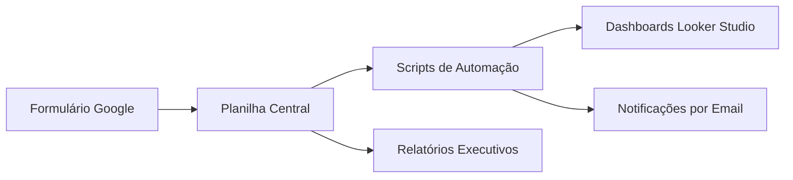

# 🚀 Portal da Engenharia - Automação Inteligente

**Solução completa** para gestão de processos técnicos desenvolvida para a KOPRON, combinando **automação, organização e análise de dados** em uma plataforma integrada.

## ✨ Destaques do Projeto
- **Redução de 40%** em inconsistências de processos
- **Economia de 50%** no tempo de resposta às solicitações
- **100% das demandas** padronizadas e rastreáveis
- **10+ analistas** trabalhando de forma integrada
- **15 planilhas** automatizadas e interligadas

## 🛠️ Arquitetura do Sistema

## 🔧 Tecnologias Principais

| Área          | Tecnologia               |
|---------------|--------------------------|
| Automação     | Google Apps Script (JavaScript) |
| Banco de Dados| Google Sheets            |
| Frontend      | Google Sites             |
| BI            | Google Looker Studio     |
| Integração    | Google Drive API         |

## 📈 Benefícios Implementados

- **Controle de prazos**: Cálculo automático considerando feriados e finais de semana  
- **Atualização em tempo real**: Status visível para toda a equipe  
- **Relatórios automáticos**: Análise de desempenho por projeto/analista  
- **Solicitações padronizadas**: Formulários unificados com validação  

## 📂 Estrutura Principal

1. **Formulário de Solicitação**  
   - Captura padronizada de informações  
   - Vinculação automática ao solicitante  

2. **Planilha Central**  
   - Consolidação de todas as demandas  
   - Atualização automática de status  

3. **Módulo de Analistas**  
   - Interface personalizada por usuário  
   - Alertas de vencimento  

4. **Sistema de Relatórios**  
   - Métricas de produtividade  
   - Identificação de gargalos  

## 👩💻 Sobre a Desenvolvedora

**Thais Priscila Lopes**  
Analista de Sistemas | Especialista em Automação de Processos  

💼 [LinkedIn](#) | 💻 [GitHub](#)  
📧 thais2422@gmail.com  

> "Sistemas bem projetados transformam desafios operacionais em vantagens competitivas."

[📄 Documentação Completa](#)
